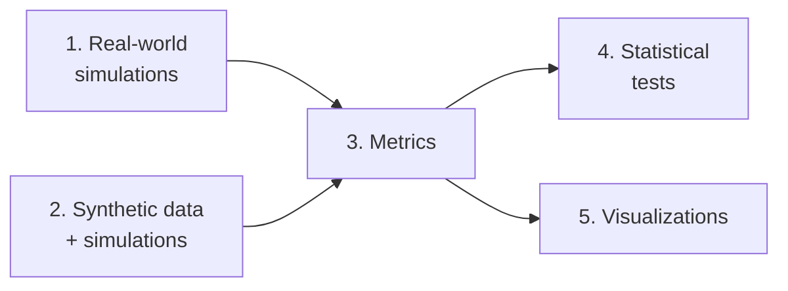

# Disapproval-Extended ABC Voting Rules — Simulations

*Code accompanying a Bachelor's thesis on disapproval-extended approval-based committee (ABC) voting rules.*

<p>
  
  
  
  
</p>

This pipeline runs traditional ABC rules (**PAV**, **seq-Phragmén**, **MES**, **AV**) and their
tax-extended counterparts (**TaxPhragmen**, **TaxMES**) against real-world [Polis](https://pol.is/)
datasets and synthetically generated approval/disapproval profiles, then computes comparison
metrics, statistical tests, and plots.

## Contents

- [Requirements](#requirements)
- [Installation](#installation)
- [Project layout](#project-layout)
- [Architecture](#architecture)
- [Running the pipeline](#running-the-pipeline)
- [Data attribution](#data-attribution)
- [License](#license)

## Requirements

| | |
|---|---|
| **Python** | 3.11+ — some scripts use nested-quote f-strings, a 3.12+ language feature. Developed and tested on **3.13**. |
| **Solver** | A [Gurobi](https://www.gurobi.com/) license for `abcvoting`'s optimization backend. A free [academic/educational license](https://www.gurobi.com/academia/academic-program-and-licenses/) works. |

> [!WARNING]
> A size-limited license (e.g. the default trial/community license) will fail on larger
> real-world datasets with `GurobiError: Model too large for size-limited license`.

## Installation

```bash
pip install -r requirements.txt
```

> [!NOTE]
> `matplotlib` is pinned to a pre-release version (`3.11.0rc1`) — if `pip` refuses it, either
> add `--pre` or relax the pin to the latest stable release. `pingouin` is left unpinned; pin it
> yourself once you know the version you use (`pip show pingouin`).

## Project layout

```text
data/
  Real-World/openData-master/        Polis export datasets (one folder per dataset)
  Synthetic Data/pd_<value>/          Synthetic datasets, one folder per disapproval
                                       probability, sampler-named subfolders inside
Results/
  Results Real-World/                 Simulation output, mirrors data/Real-World structure
  Results Synthetic/pd_<value>/       Simulation output, mirrors data/Synthetic Data structure

Real-world Simulations/
  Traditional Methods/                PAV, seq-Phragmen, MES, AV
  Tax Methods/                        TaxPhragmen, TaxMES

Synthetic Simulations/                Synthetic data generation + simulation runners

Metrics, Tests & Plots/
  Metrics/                            Per-rule/per-dataset metric computation
  Statistical Tests/                  Hamming-distance group comparisons (ANOVA/Welch)
  Visualizations/                     All plots for the thesis
```

## Architecture

Each stage follows a **runner / methods split**:

- `*_methods.py` — pure functions, no file paths or execution logic
- `run_*.py` — parameters, paths, and the actual execution

Path resolution is self-contained: every runner computes its own project root from its file
location (`Path(__file__).resolve().parents[N]`), so nothing needs to be configured or edited to
run the pipeline after cloning — it works from any location on any OS as long as the folder
structure above stays intact.

## Running the pipeline

Run the stages **in order** — each one reads the previous stage's output.



### 1. Real-world simulations
`Real-world Simulations/`

| Script | Does                                                                                                                                            |
|---|-------------------------------------------------------------------------------------------------------------------------------------------------|
| `Traditional Methods/run_sim_batch.py` | Runs PAV / seq-Phragmen / MES / AV on every dataset under `data/Real-World/openData-master/`, writes to `Results/Results Real-World/<dataset>/` |
| `Tax Methods/run_tax_batch.py` | Same, for TaxPhragmen / TaxMES                                                                                                                  |
| `run_sim_single.py` / `run_tax_single.py` | Runs a single hardcoded dataset (`american-assembly.bowling-green`) for quick manual testing                                                    |

### 2. Synthetic data + simulations
`Synthetic Simulations/`

- `run_synthetic_sampling.py` generates synthetic profiles (resampling, impartial culture,
  Euclidean threshold models) into `data/Synthetic Data/`.

  > [!CAUTION]
  > `P_Disapprove` at the top of the file is a single hardcoded constant, **not a loop**. To
  > generate the datasets for the next `pd` level (0.01, 0.05, 0.1, 0.15, 0.2), manually edit
  > `P_Disapprove` and rerun the script. Output is **not** namespaced by `pd` value — it always
  > writes to the same sampler-named subfolders under `data/Synthetic Data/` — so move the batch
  > you just generated into its `pd_<value>` folder **before** rerunning with a new
  > `P_Disapprove`, otherwise the next run silently overwrites it.

- `run_synthetic_experiments.py` runs all traditional and tax methods over every `pd_<value>`
  folder found under `data/Synthetic Data/`, writing to `Results/Results Synthetic/pd_<value>/`

### 3. Metrics
`Metrics, Tests & Plots/Metrics/`

- `run_metrics.py` computes per-rule metrics (net score, voter utility, Gini coefficient,
  disapproval avoidance, Hamming distances) for both real-world and synthetic results, writing
  `metrics_real_world.csv` and `metrics_synthetic.csv`
- `generate_metrics_overview.py`, `correlation_test.py`, `run_stats_test.py` are secondary
  analyses that read those two CSVs

### 4. Statistical tests
`Metrics, Tests & Plots/Statistical Tests/`

- `run_statistical_tests.py` — the Hamming-distance group comparisons (Levene → one-way
  ANOVA/Tukey or Welch/Games-Howell depending on variance homogeneity) reported in the thesis,
  on both real-world and synthetic data

### 5. Visualizations
`Metrics, Tests & Plots/Visualizations/`

- `run_visualizations.py` regenerates every plot used in the thesis from the two metrics CSVs,
  into `Visualizations/Plots/`

> [!TIP]
> Each script can be re-run independently as long as the CSVs/results it reads already exist
> from an earlier stage.

## Data attribution

The real-world datasets under `data/Real-World/openData-master/` are Polis conversation exports
published by the [Computational Democracy Project](https://compdemocracy.org/), licensed under
[CC BY 4.0](https://creativecommons.org/licenses/by/4.0/).

> Data was gathered using the Polis software (compdemocracy.org/polis) and is sub-licensed under
> CC BY 4.0 with Attribution to The Computational Democracy Project. The data and more
> information about how the data was collected can be found at the following links:

- https://compdemocracy.org/case-studies/2014-seattle-15-per-hour
- https://compdemocracy.org/case-studies/2018-kentucky
- https://compdemocracy.org/case-studies/2022-Austria-Klimarat
- https://compdemocracy.org/case-studies/2017-brexit-consensus
- https://compdemocracy.org/case-studies/2016-canadian-electoral-reform
- https://compdemocracy.org/case-studies/2015-football-concussions
- https://compdemocracy.org/case-studies/2022-london-youth-policing
- https://compdemocracy.org/case-studies/2018-march-on
- https://compdemocracy.org/case-studies/2017-scoop-hivemind-affordable-housing
- https://compdemocracy.org/case-studies/2019-scoop-hivemind-biodiversity
- https://compdemocracy.org/case-studies/2017-scoop-hivemind-freshwater
- https://compdemocracy.org/case-studies/2018-scoop-hivemind-taxes
- https://compdemocracy.org/case-studies/2017-scoop-hivemind-ubi

Synthetic datasets are generated by this repository's own code (`run_synthetic_sampling.py`) and
carry no external license.

## License

Copyright (C) 2026 Paul Czanek

This program is free software: you can redistribute it and/or modify it under the terms of the
GNU General Public License as published by the Free Software Foundation, either version 3 of the
License, or (at your option) any later version. See [`LICENSE.txt`](LICENSE.txt) for the full
text. This project depends on `pingouin`, `prefsampling`, and `trivoting`, which are themselves
licensed GPL-3.0(-or-later).
